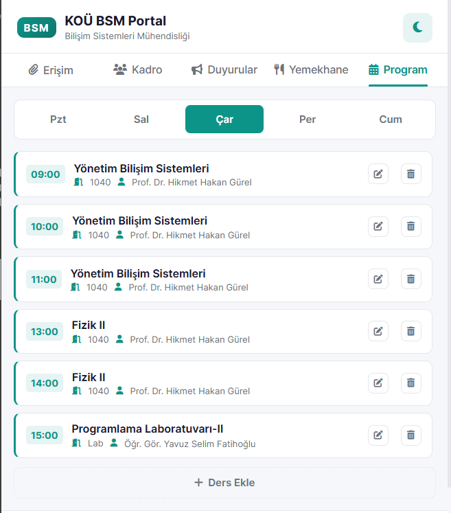
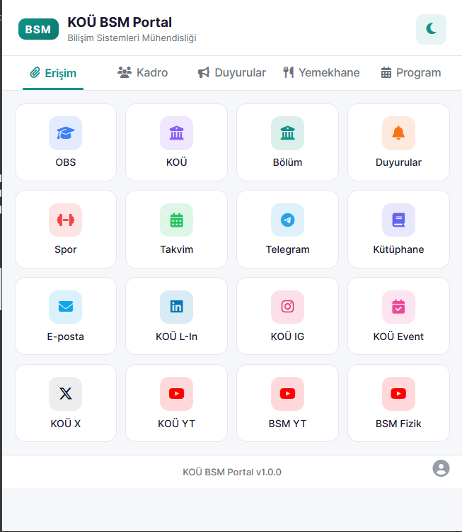
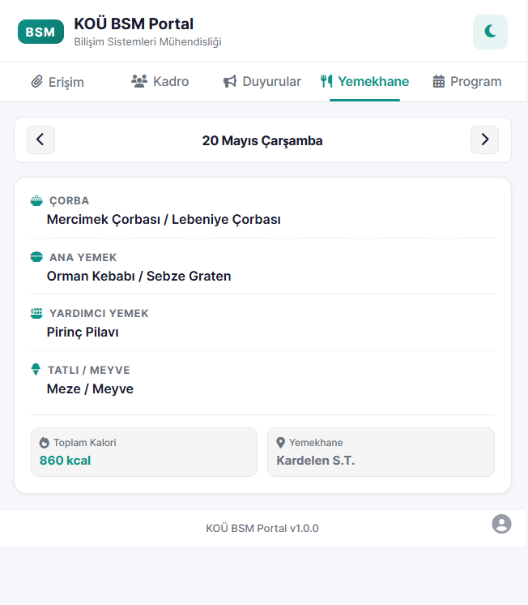
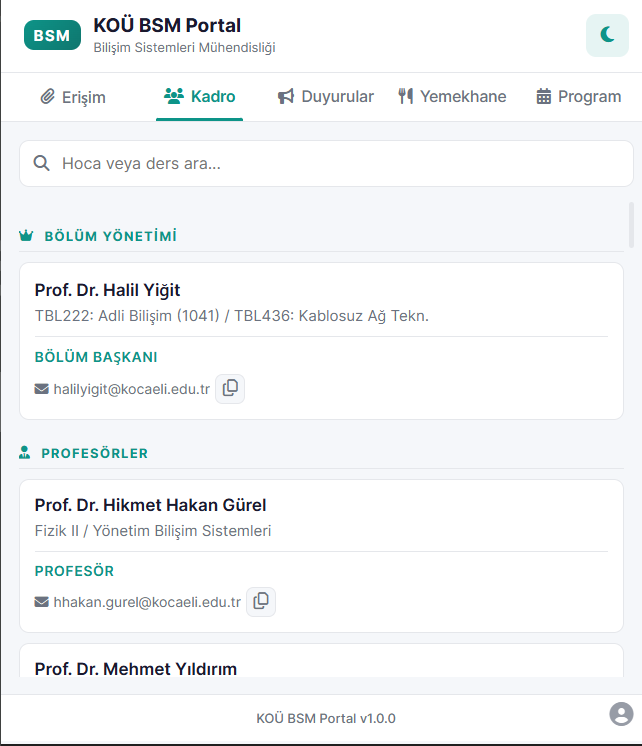
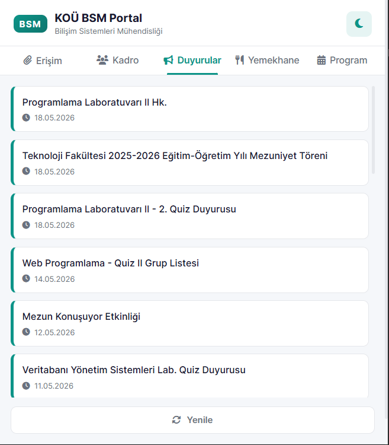
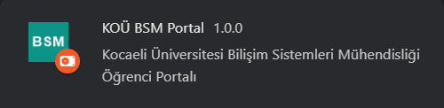
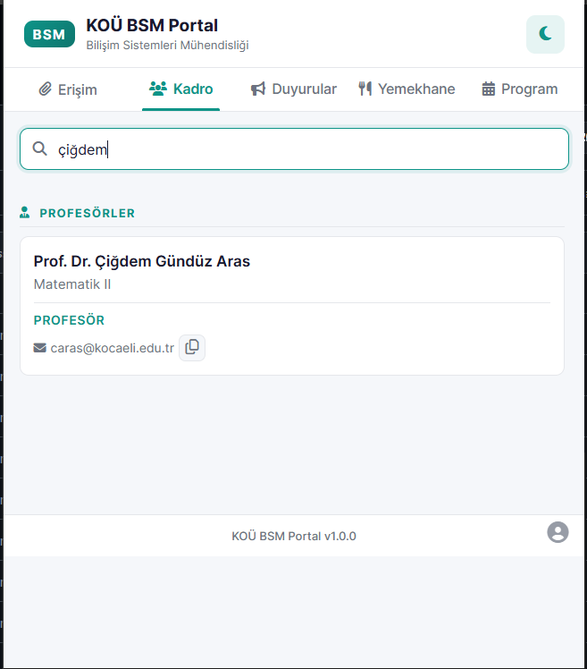

# KOÜ BSM Portal

Kocaeli Üniversitesi Bilişim Sistemleri Mühendisliği Portalı


BSM Bölümü ile alakalı gereken her site, link ve hoca bilgisine tek tıkla ulaşabilirsiniz.

<p align="center">
     
    
    
    
    
    
    
</p>

--- 

### / Ne İşe Yarar?

BSM Portal, Kocaeli Üniversitesi Bilişim Sistemleri Mühendisliği öğrencilerinin akademik olarak kullanması gereken site ve uygulamaları tek bir noktadan hızlıca erişebilmesi için geliştirilmiş açık kaynaklı tarayıcı eklentisidir.

*   **Tek Tıkla Erişim:** OBS ve bölüm sitesi gibi gün içinde sürekli elinizin altında olması gereken tüm bağlantılar tek bir panelde.
*   **Akademik Kadro:** Hocalarımızın oda numaralarına ve e-posta adreslerine anında ulaşın, tek tıkla kopyalayın.
*   **Anlık Duyurular:** Bölüm web sitesindeki duyuruları tarayıcınız üzerinden takip edebilirsiniz.
*   **Karanlık/Aydınlıkk Teması:** Gece geç saatlerde ders çalışırken gözlerinizi yormayacak karanlık mod desteği.

---

### / What is it used for?

BSM Portal is an open-source browser extension developed for Kocaeli University Information Systems Engineering students to quickly access the sites and applications they need for academic purposes from a single point.

* **One-Click Access:** All the links you need to have readily available throughout the day, such as the OBS and department website, are in one panel.
* **Academic Staff:** Instantly access and copy the room numbers and email addresses of our professors with a single click.
* **Instant Announcements:** You can follow announcements from the department website through your browser.
* **Dark/Light Theme:** Dark mode support to reduce eye strain when studying late at night.

---

## Kurulum / Installation

### - Kurulum Adımları

**1. Projeyi bilgisayarınıza indirin:**
*   **Kolay yol:** Bu sayfanın sağ üstündeki **Code** butonuna tıklayıp **Download ZIP** deyin ve inen zip dosyasını klasöre çıkartın.
*   **Git ile:** Terminalinizden şu komutla klonlayın:
    ```bash
    git clone https://github.com/umutyalcin-pen/kou-bsm-portal.git
    ```

**2. Tarayıcınızda uzantılar sayfasını açın:**
*   Google Chrome (veya Brave, Edge, Opera gibi Chromium tabanlı bir tarayıcı) açarak adres çubuğuna `chrome://extensions/` yazın ve gidin.

**3. Geliştirici modunu aktif edin:**
*   Sayfanın sağ üst köşesindeki **Geliştirici Modu (Developer Mode)** anahtarını açık konuma getirin.

**4. Klasörü tarayıcıya yükleyin:**
*   Sol üstte beliren **Paketlenmemiş öğe yükle (Load unpacked)** butonuna tıklayın.
*   Bilgisayarınızdaki klasörden, içinde `manifest.json` dosyasının olduğu `bsm-portal` ana klasörünü seçip onaylayın.

**- İpucu:** Eklentiyi kurduktan sonra tarayıcınızın sağ üstündeki uzantılar ikonuna tıklayıp **KOÜ BSM Portal**'ın yanındaki sabitleme raptiyesini işaretlerseniz, eklenti hızlı erişim çubuğunuza sabitlenir ve tek tıkla kolayca açabilirsiniz.

---

### - Installation Guide

**1. Download the repository:**
*   **Quick Way:** Click the **Code** button on this page, select **Download ZIP**, and extract the contents to folder.
*   **Using Git:** Run the following command in your terminal:
    ```bash
    git clone https://github.com/umutyalcin-pen/kou-bsm-portal.git
    ```

**2. Open the browser extensions page:**
*   Open Google Chrome (or any Chromium-based browser like Brave, Edge, Opera) and navigate to `chrome://extensions/`.

**3. Turn on Developer Mode:**
*   Toggle the **Developer Mode** switch in the top-right corner to **ON**.

**4. Load the unpacked extension:**
*   Click the **Load unpacked** button in the top-left corner.
*   Select the main `bsm-portal` folder (the one containing the `manifest.json` file).

**- Pro-Tip:** After installation, click the extension icon in your browser's toolbar and click the pin next to **KOÜ BSM Portal** to keep it fixed on your address bar for quick access!

---

## Katkıda Bulunun / Contribution

Bu bir öğrenci projesidir. Hata raporları veya yeni özellik önerileri için ıssue açabilir veya doğrudan pull req gönderebilirsiniz.

---

### / Proje Teknolojileri / Project Technologies:
<p align="left"><a href="https://developer.mozilla.org/en-US/docs/Web/HTML" target="_blank" rel="noreferrer"></a> <a href="https://developer.mozilla.org/en-US/docs/Web/CSS" target="_blank" rel="noreferrer"></a> <a href="https://developer.mozilla.org/en-US/docs/Web/JavaScript" target="_blank" rel="noreferrer"></a> <a href="https://developer.chrome.com/docs/extensions/mv3/intro/" target="_blank" rel="noreferrer"></a> <a href="https://www.python.org" target="_blank" rel="noreferrer"></a> <a href="https://code.visualstudio.com/" target="_blank" rel="noreferrer"></a> <a href="https://github.com/" target="_blank" rel="noreferrer"></a></p>

---

## Feragatname / Disclaimer & KVKK

### Türkçe
*   Bu yazılım Kocaeli Üniversitesi'nin resmi bir uygulaması veya iştiraki değildir.
*   Eklenti içerisinde sunulan veriler (Duyurular, akademik bilgiler vb.) üniversitenin halka açık web servislerinden ve web sitesinden anlık olarak çekilmektedir. Verilerin güncelliği ve doğruluğu konusunda eklenti geliştiricisi hiçbir garanti vermez.
*   **Kişisel Verilerin Korunması (KVKK):** Eklenti içerisinde yer alan akademisyen bilgileri (ad, unvan, ders bilgisi, e-posta), Kocaeli Üniversitesi resmi web sitesinde kamuya açık olarak yayınlanan rehberden derlenmiştir. Eklentinin tek amacı öğrencilerin ders hocalarına hızlı erişimini kolaylaştırmaktır. Bilgilerinin eklentiden kaldırılmasını talep eden akademisyenlerimiz geliştirici ile (GitHub veya e-posta yoluyla) iletişime geçtiği takdirde ilgili veriler derhal kaldırılacaktır.
*   Bu eklentinin kullanımından doğabilecek herhangi bir veri kaybı, yanlış bilgilendirme veya teknik sorundan kaynaklanan sorumluluk tamamen kullanıcıya aittir.

### English
*   This software is not an official application or affiliate of Kocaeli University.
*   The data provided within the extension (Announcements, academic information, etc.) is fetched in real-time from the university's public web services and website. The developer of the extension provides no guarantee regarding the currency and accuracy of the data.
*   **Personal Data Protection (GDPR/KVKK):** The academic staff information (name, title, courses, email prefix) included in the extension is compiled from Kocaeli University's publicly available official directory. The sole purpose of the extension is to facilitate students' quick access to faculty members. Faculty members who request their information to be removed can contact the developer (via GitHub or email), and their data will be removed immediately.
*   Any responsibility arising from data loss, misinformation, or technical issues resulting from the use of this extension belongs entirely to the user.

---

## Lisans / License

Bu proje [MIT Lisansı](LICENSE) altında lisanslanmıştır. / This project is licensed under the [MIT License](LICENSE).


## Geliştirici / Developer

- **Umut Yalçın** - [umutyalcin-pen](https://github.com/umutyalcin-pen)
